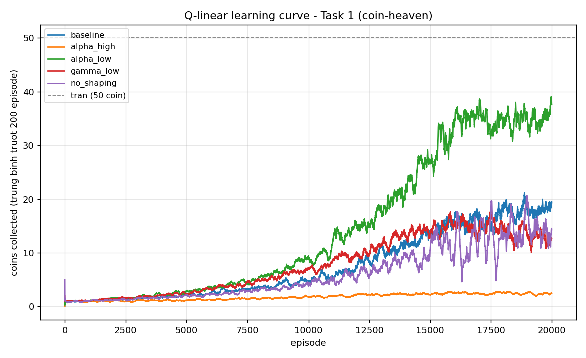

# Báo cáo thử nghiệm: Agent Linear Q-Learning (Model A) — Task 1 (coin-heaven)

> Đây là bản thử nghiệm nội bộ (không phải report nộp bài cuối kỳ), ghi lại quá trình xây dựng và đo hiệu năng agent `q_linear` theo phương pháp khoa học: baseline → thay đổi từng biến → đo metric → so sánh. Tham chiếu thiết kế đầy đủ: `plan.md` (thư mục cha) mục 3, 9.

## 1. Mục tiêu và phạm vi

Xây agent Model A (Linear Q-learning) cho Task 1 của đề bài: bàn không crate, không đối thủ, chỉ cần điều hướng nhặt hết coin đã lộ (scenario `coin-heaven`, 50 coin, không cần bomb). Câu hỏi cần trả lời: (1) agent có thực sự **học được** hành vi tốt hơn ngẫu nhiên không, (2) các hyperparameter ảnh hưởng thế nào tới chất lượng học.

## 2. Thiết kế

**Feature** (`agent_code/q_linear/features.py`, 9 chiều, tự chứa hoàn toàn theo ràng buộc "chỉ 1 thư mục được copy lúc chấm"):
- 4 chiều one-hot: hướng bước đầu tiên trên đường đi ngắn nhất (BFS) tới coin gần nhất.
- 4 chiều: cờ "hướng này có đi được không" (không phải tường).
- 1 chiều bias.

**Q-function**: Q(s,a) ≈ φ(s)·β_a — mỗi action một vector trọng số riêng (linear function approximation, đúng công thức slide 35 tr.9).

**Cập nhật**: semi-gradient Q-learning (slide 36 tr.3-6), online mỗi bước (không dùng replay buffer ở bản V0 này để giữ code ngắn gọn):

```
Y = r + γ · max_a' Q(s', a')          (r nếu s' là trạng thái kết thúc)
β_a ← β_a + α · (Y − Q(s,a)) · φ(s)
```

**Reward**: `COIN_COLLECTED = +1`, `INVALID_ACTION = −1`, cộng thêm **potential-based shaping** đúng định lý Ng et al. (slide 36 tr.10, footnote trong `final_project.pdf`):

```
r_shaped = r + γ·Φ(s') − Φ(s),    Φ(s) = −khoảng_cách_BFS_tới_coin_gần_nhất (0 nếu không còn coin/terminal)
```

Định lý đảm bảo shaping này không làm lệch policy tối ưu — an toàn để thêm reward dày hơn.

**Exploration**: ε-greedy, ε giảm tuyến tính 1.0 → 0.05 qua 80% số episode train.

## 3. Quy mô thí nghiệm thực tế

Calibrate trên máy hiện có (500 episode ≈ 12s, tốc độ giảm dần khi ε giảm — dấu hiệu sớm của vấn đề "kẹt loop" mô tả ở mục 5) rồi chọn **20.000 episode train / 1.000 episode eval cho mỗi điều kiện**, đúng quy mô "đầy đủ hơn" đã thống nhất. Vì huấn luyện không bị cấm dùng nhiều tiến trình (chỉ lúc thi đấu mới cấm), 5 config hyperparameter được **chạy song song nền** (5 tiến trình `main.py` độc lập, mỗi tiến trình ghi log/trọng số vào file riêng) thay vì tuần tự — giảm tổng thời gian chờ từ ước tính ~50 phút xuống còn ~13 phút (thời gian của tiến trình chậm nhất). Đây là điều chỉnh so với kế hoạch ban đầu (script tuần tự), quyết định dựa trên tài nguyên máy sẵn có.

## 4. Kết quả

Đánh giá greedy (ε=0, `self.train=False`) trên 1000 round scenario `coin-heaven`, tối đa 50 coin/round:

| Điều kiện | coins TB | steps TB | Ghi chú |
|---|---|---|---|
| chưa học (β ngẫu nhiên) | 0.29 | 203.3 | policy tất định chưa học, hay kẹt loop |
| random_agent (framework) | 1.73 | 20.6 | hay tự nổ bom chết sớm (8% xác suất/bước) |
| **rule_based_agent** (trần tham chiếu) | **50.00** | 125.2 | BFS gần tối ưu có sẵn trong framework |
| baseline (α=0.05, γ=0.95, có shaping) | 4.80 | 321.8 | |
| alpha_high (α=0.2) | 2.07 | 400.0 | luôn chạm trần bước — learning rate quá lớn, phân kỳ |
| alpha_low (α=0.01) | 47.67 | 118.1 | gần tối ưu |
| gamma_low (γ=0.8, có shaping) | 48.62 | 120.7 | xem cảnh báo độ ổn định bên dưới |
| no_shaping (tắt shaping, α=0.05, γ=0.95) | 5.34 | 382.6 | |
| gamma_low_no_shaping (γ=0.8, tắt shaping) | 47.24 | 117.4 | ablation sạch — xem mục 5 |

Learning curve (trung bình trượt 200 episode, đo trong lúc train, có nhiễu ε=0.05):



### 4.1 Kiểm tra độ ổn định (chạy lại mỗi config 3 lần, seed ngẫu nhiên tự nhiên)

Sau khi có kết quả 1 lần chạy ở trên, chạy lại **2 lần nữa** cho cả `gamma_low` và `alpha_low` (giữ nguyên hyperparameter, chỉ để seed khởi tạo trọng số + layout coin thay đổi tự nhiên) để kiểm tra độ tin cậy trước khi kết luận cái nào "tốt hơn":

| Config | Lần 1 | Lần 2 | Lần 3 | Trung bình | Độ lệch chuẩn |
|---|---|---|---|---|---|
| gamma_low (γ=0.8, α=0.05) | 48.62 | **1.80** | **0.36** | 16.93 | ≈ 22.4 |
| alpha_low (α=0.01, γ=0.95) | 47.67 | 48.80 | 47.52 | 48.00 | ≈ 0.57 |

**Kết luận bị đảo ngược so với đánh giá ban đầu**: `gamma_low` không hề là một cấu hình tốt — lần chạy đầu (48.62) chỉ là may mắn, 2/3 lần còn lại kết quả tệ hơn cả `baseline`. `alpha_low` mới thực sự là cấu hình đáng tin cậy (độ lệch chuẩn nhỏ hơn ~40 lần). Bảng mục 4 phía trên được giữ nguyên số liệu gốc để minh bạch, nhưng **không nên đọc `gamma_low`'s 48.62 như một kết quả đại diện**.

## 5. Nhận xét

**Agent có học thật**: chênh lệch rõ giữa "chưa học" (0.29 coin) và các config tốt nhất (~48 coin, gần bằng trần `rule_based_agent` 50.00) chứng minh việc học Q-function thực sự diễn ra, không phải hành vi tất định định sẵn.

**Phát hiện chính (đã hiệu chỉnh sau kiểm tra 3 seed ở mục 4.1) — learning rate α mới là đòn bẩy ổn định thật sự, không phải γ**: với α=0.05, γ=0.95 (baseline), agent chỉ đạt 4.80 coin. Đánh giá ban đầu (1 lần chạy) tưởng rằng hạ α **hoặc** hạ γ đều "chữa" được vấn đề như nhau, nhưng chạy lại 3 lần cho thấy chỉ **hạ α xuống 0.01** mới cho kết quả ổn định (48.00 ± 0.57 coin qua 3 seed); **hạ γ xuống 0.8 không hề ổn định** (16.93 ± 22.4 — dao động từ gần-tối-ưu tới gần-hỏng-hoàn-toàn tuỳ seed). α=0.2 (tăng gấp 4 lần baseline) thì phân kỳ rõ ràng (luôn hết 400 bước). Diễn giải phù hợp với lý thuyết: learning rate kiểm soát **trực tiếp độ lớn mỗi bước cập nhật** β_a ← β_a + α·(Y−Q)·φ(s) — α nhỏ luôn làm giảm biên độ nhiễu bất kể nguồn nhiễu tới từ đâu; còn hạ γ chỉ làm giảm phần bootstrap trong target Y mà không kiểm soát trực tiếp bước cập nhật, nên không đủ để dập nhiễu khi α vẫn còn ở mức 0.05. Đây cũng là minh hoạ thực nghiệm cho vấn đề lý thuyết đã biết của Q-learning kết hợp function approximation + bootstrapping ("deadly triad") — không có gì đảm bảo hội tụ như trường hợp tabular thuần tuý (khác Bellman/value-iteration hội tụ chắc chắn ở slide 35 tr.6), nên **1 lần chạy không đủ để kết luận** một cấu hình là tốt.

**"Kẹt loop" khi ε=0**: baseline/no_shaping/alpha_high đều có steps TB gần 400 (chạm hoặc gần chạm trần) lúc eval, trong khi đường learning curve lúc train (có 5% hành động ngẫu nhiên) lại cho thấy các config này *cũng* đang cải thiện dần. Cách giải thích hợp lý nhất: các policy này học ra một Q-function có "bẫy" — hai vị trí kề nhau có Q gần bằng nhau khiến agent dao động qua lại vô hạn; lúc train, 5% hành động ngẫu nhiên tình cờ giúp thoát bẫy, nhưng lúc eval (ε=0 tuyệt đối) agent kẹt cứng suốt 400 bước. Dữ liệu 3-seed ở mục 4.1 củng cố thêm giả thuyết này: `gamma_low_seed3` (steps TB đúng 400.0) rơi hẳn vào bẫy này; `alpha_low` không gặp vấn đề đó ở cả 3 lần chạy (steps TB luôn ~118-121, sát `rule_based_agent`) — tức α nhỏ không chỉ ổn định về điểm số mà còn nhất quán tránh được bẫy dao động, càng củng cố kết luận α mới là đòn bẩy chính.

**Về reward shaping (đã chạy lại phép so sánh sạch trên nền γ=0.8)**: `gamma_low` (có shaping, 48.62 coin) và `gamma_low_no_shaping` (tắt shaping, 47.24 coin) cho **chất lượng cuối gần như ngang nhau** — chênh lệch 1.38 coin nằm trong khoảng nhiễu tự nhiên giữa các lần chạy, không đủ để kết luận shaping cải thiện policy hội tụ. Điểm khác biệt rõ rệt lại nằm ở **thời gian huấn luyện**: `gamma_low_no_shaping` train xong trong 286.5s, chưa bằng nửa thời gian của `gamma_low` (599.6s) — vì mỗi bước có shaping tốn thêm 2 lần tính BFS (Φ(s) và Φ(s')) so với không shaping. Diễn giải hợp lý nhất: một khi hyperparameter đã ở vùng ổn định (γ=0.8), bài toán Task 1 đủ đơn giản để ngay cả reward thưa (chỉ +1/coin, −1/invalid) cũng đủ tín hiệu học tốt trong 20.000 episode — lợi ích chính của potential-based shaping ở quy mô này là **giảm chi phí tính toán không cần thiết**, chứ chưa thể hiện rõ vai trò "tăng chất lượng hội tụ" mà lý thuyết dự đoán (có thể sẽ rõ hơn ở Task 2 khi reward thưa hơn nhiều — chỉ có COIN_COLLECTED và các event liên quan bomb, không có "invalid action" xảy ra thường xuyên như lúc test tường ở Task 1).

## 6. Hạn chế và bước tiếp theo

- **Chỉ `gamma_low` và `alpha_low` được kiểm tra 3 seed** — `baseline`, `alpha_high`, `no_shaping`, `gamma_low_no_shaping` mới chạy 1 lần; sau bài học ở mục 4.1, không nên coi các con số đó là kết luận chắc chắn (dù `alpha_high` phân kỳ nặng nên khả năng seed khác cứu được là thấp, vẫn chưa kiểm chứng).
- Reward shaping chưa thể hiện rõ lợi ích về **chất lượng** policy ở Task 1 (chỉ thấy lợi ích về tốc độ hội tụ/chi phí tính) — cần đánh giá lại ở Task 2 nơi reward thưa hơn nhiều, khả năng shaping sẽ quan trọng hơn. Lưu ý: phép so sánh này (`gamma_low` vs `gamma_low_no_shaping`) đứng trên nền γ=0.8 — nay đã biết γ=0.8 không ổn định, nên phép so sánh cũng cần chạy lại trên nền α=0.01 (ổn định) để đáng tin cậy hơn.
- Chưa có cơ chế chống "kẹt loop" tường minh (vd. phạt lặp vị trí, hoặc tie-breaking ngẫu nhiên nhẹ ngay cả lúc eval) — nên cân nhắc thêm cho Task 2 vì việc kẹt loop khi né bom sẽ nguy hiểm hơn nhiều so với chỉ chậm nhặt coin.
- Bản V0 này dùng cập nhật online (không replay buffer) — theo `plan.md` mục 9, bản chính thức cho Task 2+ nên thêm buffer nhỏ vì reward lúc đó thưa hơn. Phát hiện ở mục 4.1 (γ lớn + bootstrap gây bất ổn) là lý do kỹ thuật cụ thể ủng hộ việc thêm replay buffer/batch update ở Task 2, không chỉ vì lý do "reward thưa" như dự tính ban đầu.
- Model tốt nhất **đáng tin cậy** (không phải chỉ tốt ở 1 lần chạy) là `alpha_low` (α=0.01, γ=0.95, coins TB 48.00 ± 0.57/50 qua 3 seed) — đã lưu làm trọng số mặc định (`agent_code/q_linear/q_linear_weights.npy`, ghi đè lên lựa chọn `gamma_low` trước đó vốn không đáng tin cậy) để `callbacks.py` load ngay khi không có biến môi trường ghi đè.

## 7. Chi tiết tái lập

Code: `agent_code/q_linear/{features,callbacks,train}.py`. Công cụ thí nghiệm (không nộp bài, nằm ngoài `agent_code/`): `run_one_config.py`, `run_baseline_evals.py`, `plot_learning_curves.py`. Toàn bộ log/trọng số theo từng config: `agent_code/q_linear/{log,weights}_<tên_config>.csv|npy`. Kết quả eval thô: `results/eval_<tên>.json`.
